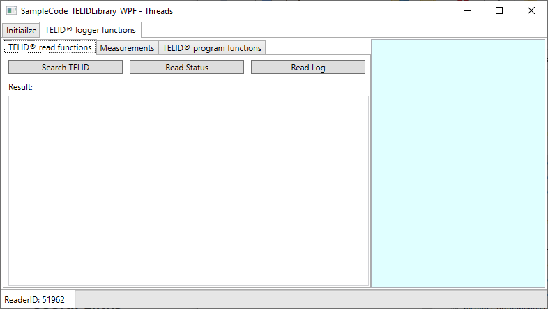

# Sample code for .NET library
This sample code is for handling **TELID®300** dataloggers on Windows devices using a Micro-Sensys USB RFID reader.

> For details on DOC communication check [Useful Links](#Useful-Links) 

## Requirements
* IDE Visual Studio
* Micro-Sensys RFID reader
* TELID®300 datalogger

## Implementation
This code shows how to use **TELIDLibrary.TelidControl** class to communicate with a TELID®300 datalogger. 
There are functions available to find, read log and program new logging process.

> Class information is available under API documentation. See [Useful Links](#Useful-Links)

## Steps
Import the project into your IDE and make sure the Micro-Sensys USB RFID reader is connected to the computer.
There are three different projects available. Choose one and run the code.
Main window has two tabs, one to initialize the communication with the reader, and other to provide TELID® functionality.

 First of all, select interface parameters and press "Initialize". Then check RFID reader is detected and Reader ID is shown in bottom part of the window. Then switch to *TELID® logger functions* tab
 1. *TELID® read functions* tab contains three buttons:
	* *Search TELID* will search for a TELID® dataloger near the antenna and show the type and serial number
	* *Read Status* will search for a TELID® dataloger and read the current status. The result will be shown on the side view, and if a TELID® dataloger is found the status information is shown in TextBox below
 	* "Read log" will read the logged measurements. This can be performed only after the status is read. The read progress is shown using the ProgressBar at the bottom of the window
 2. *Measurements* tab contains a ListBox where the measurements are displayed after successfully read from TELID® data logger.
 3. *TELID® program functions* tab contains buttons to stop the current log process and restart a new one with fixed parameters (in Code)
 
## Useful Links

* [NuGet Package page](https://www.nuget.org/packages/Microsensys.TELIDLibrary/)
* [API documentation](https://www.microsensys.de/downloads/DevSamples/Libraries/Windows/TELIDLibrary%20-%20.NET%20library/)
* Check what offers our TELID®soft for PC! Download using [this link](https://www.microsensys.de/downloads/CDContent%20TELIDsoft.zip)
* GitHub *documentation* repository: [Micro-Sensys/documentation](https://github.com/Micro-Sensys/documentation)
	* [communication-modes/doc](https://github.com/Micro-Sensys/documentation/tree/master/communication-modes/doc)

## Contact

* For coding questions or questions about this sample code, you can use [support@microsensys.de](mailto:support@microsensys.de)
* For general questions about the company or our devices, you can contact us using [info@microsensys.de](mailto:info@microsensys.de)

## Authors

* **Victor Garcia** - *Initial work* - [MICS-VGarcia](https://github.com/MICS-VGarcia/)
